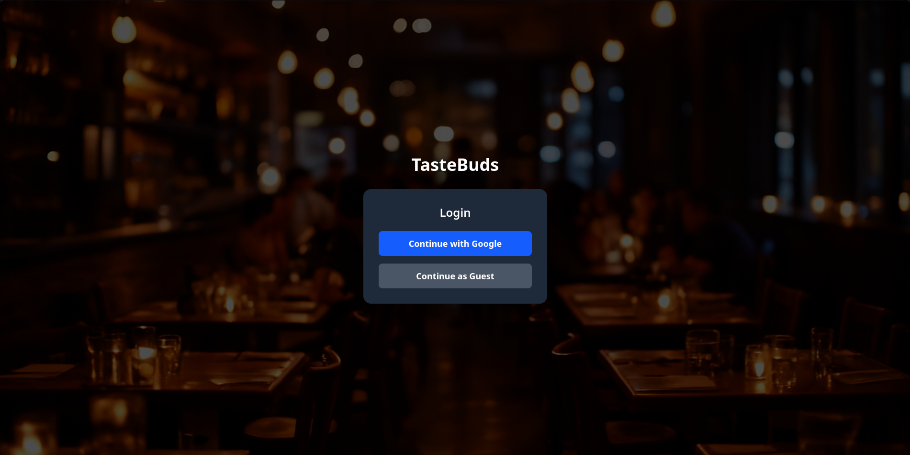
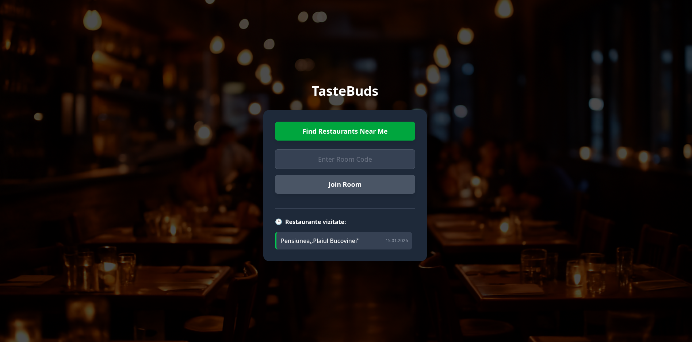
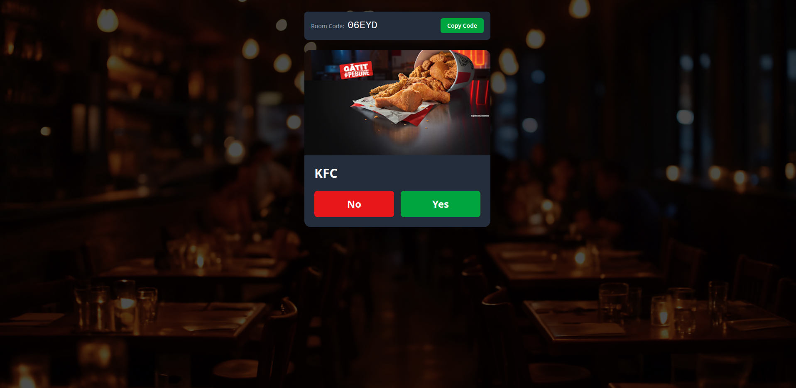

# TasteBuds

Tastebuds is a web application that allows users to find restaurants near their location and match their preferences. It is built using React and Firebase.

### 1. Login Screen
Secure entry into the app. Users can choose between a synchronized experience via Google or a quick anonymous Guest session.
<p align="center">
  
</p>

### 2. Home Screen
The main hub where you can create a new room based on your current GPS location or join a friend's room using a unique code. Your personal dining history is also displayed here.
<p align="center">
  
</p>

### 3. Swipe Screen
The core experience. Press "Yes" or "No" on restaurant cards. Matches are tracked in real-time as your group votes.
<p align="center">
  
</p>

## Features

* **Google Authentication**: Users can log in using their Google account.
* **Guest Authentication**: Users can log in as guests without creating an account.
* **Room Creation**: Users can create a virtual room, granting GPS permission to fetch nearby restaurants.
* **Join Room**: Others can join via a unique 5-character code (e.g., "A1B2C").
* **Swiping Mechanism**: Users vote "Yes" (Right) or "No" (Left) on restaurant cards.
* **Real-time Matching**: Instant notification when all members like the same restaurant.
* **Winner Selection**: If multiple matches exist, the app randomly selects a final winner to settle the debate.
* **Google Maps redirection**: Users can be redirected to Google Maps for directions.
* **History Tracking**: Users can view their favorite restaurants (Google logged users only!).

## Design Patterns

* **Factory Pattern**: Used for the standardized instantiation of `Room` objects, centralizing the logic for ID generation and data structure initialization.
* **Facade Pattern**: A dedicated service (`HistoryService`) that simplifies complex interactions with Firebase collections, providing clean and high-level methods for the rest of the application.

## Tech Stack

| Component | Technology | Role / Usage |
|:---|:---|:---|
| **Frontend** | React.js | User interface and state management |
| **Styling** | Tailwind CSS | Modern and responsive design |
| **Backend** | Python (Flask) | API Proxy for Google Places |
| **Database** | Firebase Firestore | NoSQL storage and real-time synchronization |
| **Authentication** | Firebase Auth | Google Sign-In implementation |
| **External API** | Google Places API | Restaurant data and geolocation services |

## Installation and Usage

### 1. Backend (Python)
Install the necessary dependencies and start the Flask server:
```bash
cd backend
pip install flask flask-cors requests
python main.py
```

### 2. Frontend (React)
Install the necessary dependencies and start the React development server:
```bash
cd frontend
npm install
npm run dev
```

### 3. Firebase Setup
Initialize Firebase in your project and configure the necessary settings in the `firebaseConfig` object within `src/firebase.js`. Ensure you have the Firebase SDK installed and properly set up.

### 4. API Keys in .env
Create 2 `.env` files in the root directory of the project: `backend/.env` and `frontend/.env`. Add your API keys and secrets for the backend and frontend respectively.
